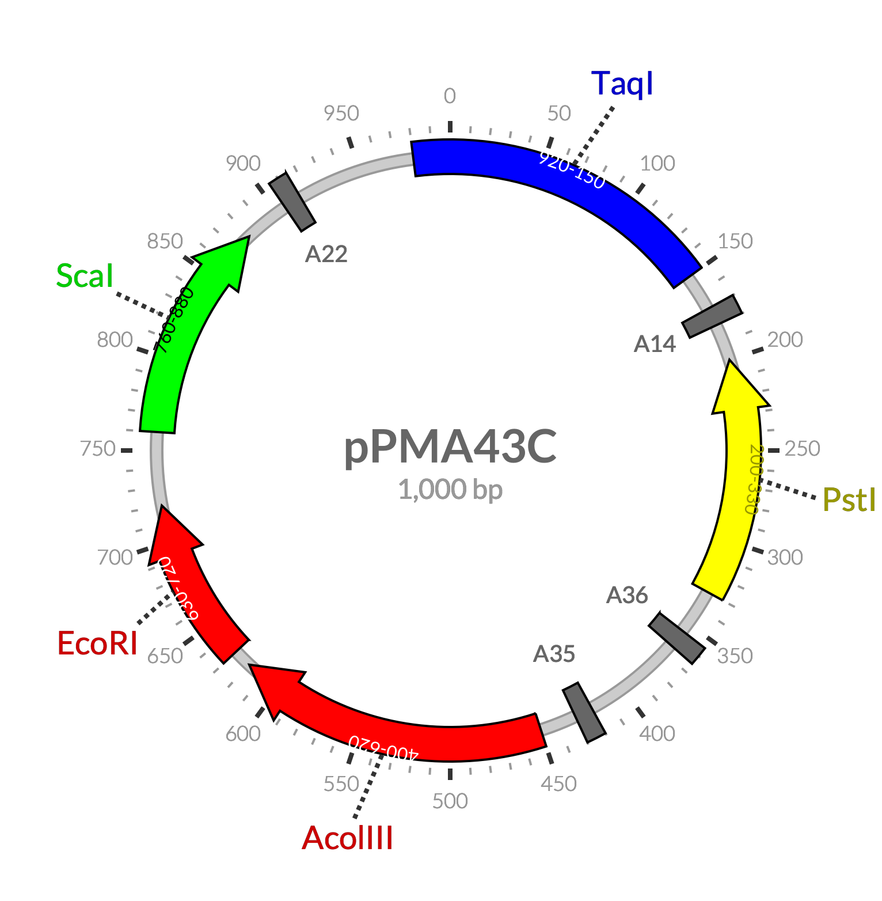

# Render2Plasmid

Render a plasmid map using PhantomJS and AngularPlasmid.

# Status

Currently only a prototype and requires extensive engineering.

# Sample

# TODO

- [ ] Implement an effective method to colorize the segments according to their type
- [ ] Prevent overlap of the symbols
- [ ] Integrate it into Phabricator (refer to [render2katex](/ProfFan/render2katex))

# LICENSE

MIT
